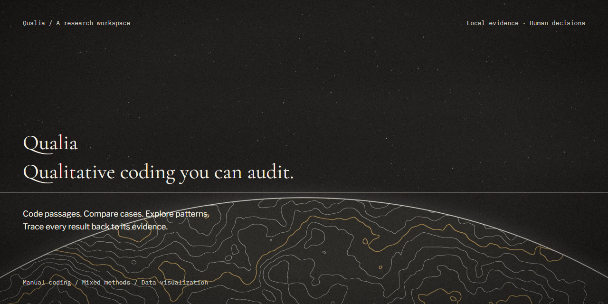
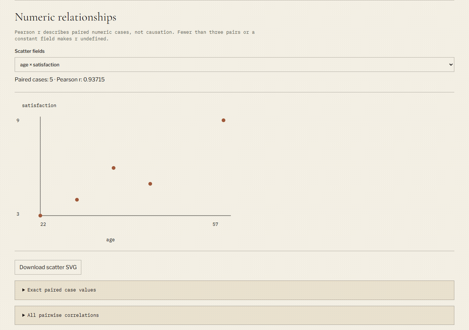
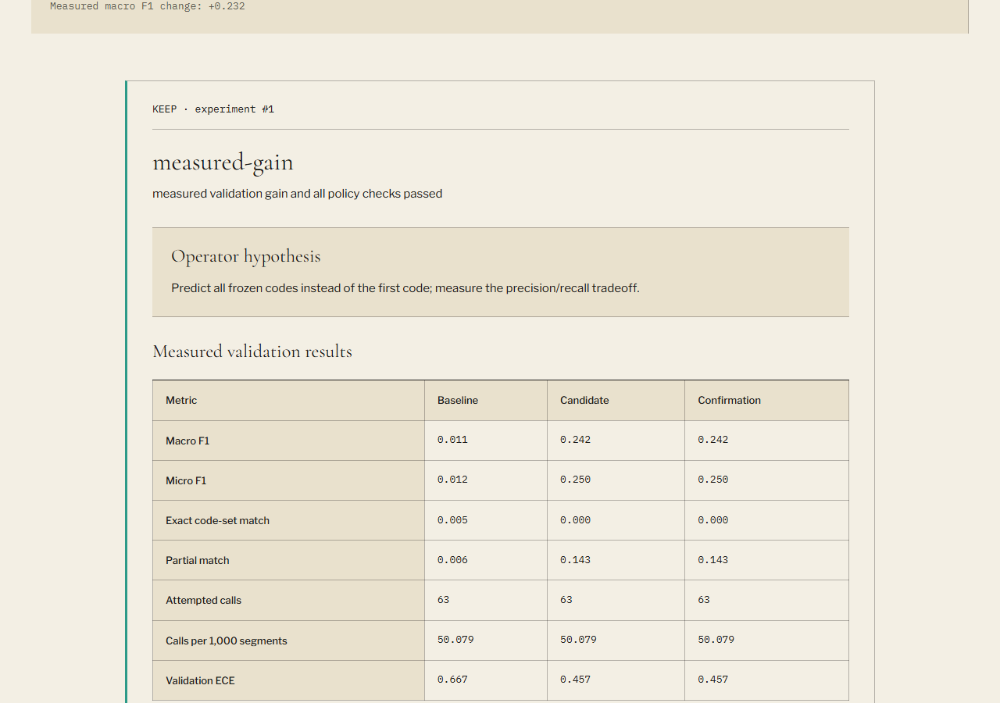
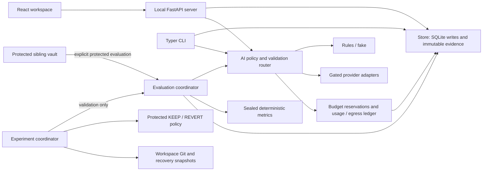

# Qualia

**Qualitative coding you can audit.**

Read transcripts, apply a human-defined codebook, review AI suggestions, and inspect the evidence behind every coding decision. Qualia keeps source spans, frozen codebook versions, actor identity, model provenance and experiment measurements together in a local workspace.

The manual, rules and deterministic fake workflows are implemented and tested. Native classification uses each user's official CLI subscription sign-in with explicit project permission and bounded execution; file-editing improvement agents remain gated. Jev is installed but optional and disabled by default. This repository is private. The static public-data demonstration has been built locally and is not deployed.





The tour combines the licensed public demo, offline fake review/experiment evidence, and an explicitly synthetic numeric example. Start with the [illustrated user guide](docs/USER-GUIDE.md); see the [final verification and remaining setup](docs/FINAL-REPORT.md) for the exact handoff.

## Run locally

Use Python 3.14, Node 24, Git and uv. The verified Windows environment used Node 24.14.1. From this repository:

```powershell
uv sync
npm --prefix web ci
npm --prefix web run build
uv run python scripts/fetch_demo.py
uv run qualia demo
uv run qualia open
```

The fetch verifies the pinned AnnoMI CSV checksum before publication. Repeating the demo command adds no duplicate sources, segments or annotations. The server opens at `http://127.0.0.1:8765`; use `uv run qualia open --port 8766` when that port is occupied.

Research projects live outside this checkout, under `%USERPROFILE%/Qualia` on Windows by default. Set `QUALIA_HOME` in a local, ignored `.env` to choose another directory outside the app repository. The browser receives a per-launch API token; the server checks its token and Host header.

For your own study, run `uv run qualia init my-study`, open the app, choose that project, import TXT/Markdown or mapped CSV, define codes, and freeze a codebook version before coding. See the [step-by-step user guide](docs/USER-GUIDE.md) for the complete workflows.

## Work with evidence

1. In **Workspace**, select a transcript. Use Up/Down to move between segments and 1–9 to assign a code. Select text to code a narrower span. Memos, retrieval and the case-by-code matrix keep related evidence accessible.
2. In **Review**, choose `rules` or `fake` and **Current source** to try suggestions offline. Select a suggestion and press `a` to accept or `r` to reject. Dashed suggestion marks become solid accepted marks with an `m`; the original suggestion and human feedback remain in the history.
3. Use **Evaluation** for validation metrics and calibration evidence. Scores beside suggestions are model-reported; an ECE value is shown only when a matching validation result exists.
4. Use **Export → Reproducibility bundle** to include coding history, versions, experiments, evaluations, usage and configuration hashes. Text is excluded by default. A no-text export preserves identifiers and provenance; it is not a de-identification guarantee.

The full demo contains 8,017 visible segments and exceeds the default 2,000-segment run limit. Select a source or specific segments for classification; validation evaluates its complete 1,258-record split.

```powershell
uv run qualia availability --project demo
uv run qualia classify --project demo --backend fake --segments 1,2,3
uv run qualia evaluate --project demo --split validation --backend fake
uv run qualia history --project demo
```

## Mixed-methods analysis and data science

The **Analysis** workbench adds read-only coding frequencies, case-attribute comparisons,
co-occurrence, literal text/code queries and Unicode word frequencies. Bars, heat tables
and numeric scatter plots retain exact data tables and links to contributing excerpts.
Choose numeric case attributes explicitly to see valid/missing/invalid counts, mean,
median, sample standard deviation, range and pairwise-complete Pearson correlation.
The report states its denominator, filter criteria and input fingerprint.

```powershell
uv run qualia analyze --project demo --group-by mi_quality
uv run qualia analyze --project my-study --numeric age --numeric score --format csv
uv run qualia analyze --project my-study --numeric age --numeric score --format python
```

Download the case CSV and matching Python or R starter from the same analysis criteria.
Run scripts yourself outside Qualia; the application never executes arbitrary analysis code.
The Python starter uses its standard library, and the R starter uses base R. Exported JSON
includes the column dictionary, criteria and provenance. CSV values have reversible formula
escaping. Transcript text is excluded, but case names, attributes and query criteria may
still be sensitive: no-text export is not anonymization.

Repeated spans do not inflate segment/case presence. Same-segment co-occurrence and actual
span overlap are distinct; Jaccard is always labeled segment-presence similarity. Missing
data is not zero, and correlation is not causation. Pearson is unavailable below three
complete pairs or for constant values. Advanced inference/model fitting, audio/video,
real-time collaboration and proprietary NVivo project import are not implemented.
See [the researched conventions](docs/research/research-analysis.md).

## Measured implementation experiments

On a clean, freshly seeded demo, this runs one deterministic candidate and an independent confirming evaluation:

```powershell
uv run qualia improve --project demo --agent fake --budget 1
```

The fake operator changes classification configuration. Qualia checks edit scope, database integrity, protected methodology, tests, privacy and budget limits, then evaluates the fixed validation split. A qualifying candidate needs a confirming run before KEEP. Failed candidates receive REVERT and an auditable report. Re-running an already applied fake candidate may produce REVERT because there is no further gain.



The verified local MVP used the actual pinned AnnoMI demo:

| Evidence | Observed result |
|---|---:|
| Imported expert human annotations | 8,017 |
| Additional keyboard assignments | 5 |
| Fake suggestions on one source | 36, from 2 calls |
| Human suggestion reviews | 1 accept, 1 reject |
| Total immutable coding events after that workflow | 8,060 |
| Validation records | 1,258 |
| Macro F1: rules baseline → fake candidate → confirmation | 0.01058468 → 0.24242447 → 0.24242447 |
| Classification calls per evaluation | 63 |
| Recorded decision and tag | KEEP · `exp-0001-measured-gain` |

This is a scripted fake-backend smoke test of measurement, policy and provenance. It is not evidence of trained-model quality. Predicting all seven codes improved macro F1 in this run while exact match fell from approximately 0.00477 to 0. The before/after table retains both outcomes.

An interrupted finalization leaves a recovery journal at `QUALIA_HOME/recovery/<project>/pending.json` and blocks further writes. Preserve the journal and its snapshot, inspect the recorded stage and Git/database state, and resolve recovery explicitly. Do not delete the journal or operation lock merely to clear the error.

## Optional AI setup

Rules and fake classification need no provider account. Native classification uses your own official CLI subscription sign-in: audited Claude Code2.1.284 or Codex0.160.0, with exact-version checks at dispatch. The workflow stays in Qualia's UI; no AI desktop app needs to remain open. Each user installs/signs in locally, enables external processing deliberately and retains their own account and data. No API key is needed for subscription classification. Qualia does not read or proxy login tokens; Claude Console/API mode is rejected and Codex forces ChatGPT mode. File-editing improvement agents remain disabled pending filesystem isolation.

The owner [approved practical native limits](docs/answers/01-native-usage.md): five-segment batches, bounded input/output,90-second default deadline, no automatic native application retry, and one reservation/egress record per CLI invocation. Internal provider requests may be multiple; native call counts are not exact HTTP or subscription-quota counts. Codex has no provider generation-token cap. See [setup and limits](docs/USER-GUIDE.md#12-generate-and-review-ai-suggestions), [adapter/live evidence](docs/research/cli-classification.md) and [subscription documentation assessment](docs/research/subscription-policy.md).

Jev's adapter and local controls are installed. This installation passed two synthetic live requests with a combined recorded cost of $0.00003570. Jev is enabled for demo with its existing $1 daily local limit; new projects remain off by default. Other installations need their own account, key and project opt-in. Follow [Jev setup](docs/JEV-SETUP.md); keep the key in ignored `.env`, never in chat or frontend configuration. Check readiness without a network request:

```powershell
uv run qualia jev check --project demo
```

## Architecture



Only `qualia/store/db.py` writes the application database. Coding, review, evaluation, usage and experiment evidence is append-only; frozen codebooks remain immutable. Core and metric modules have no database, process or network access. Provider attempts require egress permission and budget admission; cache identity includes the actual batch context. Improvement cannot apply codebook or methodology changes.

## Data and public demonstration

The demo pins AnnoMI to commit `42936645ec3857a9c84ab296a36a3c34b779ef49`. Its deterministic transcript split contains 6,759 development, 1,258 validation and 1,682 protected utterances. Development and validation occupy 106 visible transcript cases; protected text and labels stay only in the sibling vault. Splits isolate transcripts, but some source videos overlap and public data may have appeared in model training.

[DATA-LICENSES.md](DATA-LICENSES.md) records the authors' public-domain statement, citations, checksum and the limits of that evidence. The pinned AnnoMI repository has no LICENSE file establishing a particular SPDX dedication; underlying video/audio rights are not included. Qualia's concise demo definitions are attributed paraphrases, not invented upstream inclusion/exclusion rules.

The locally verified static snapshot contains 24 utterances from two development transcripts with attribution and provenance. Its ten research views make zero API requests and have no editing or AI capability. It contains no private-workspace or protected-vault data. Final Lighthouse scores are 96 performance and 100 accessibility, with CLS 0.000125. Hosting remains pending; no public URL is claimed. The Pages workflow is prepared and gated on repository visibility; the owner has not made this repository public.

## Verification

The latest full Python checkpoint passed **411 tests**, with five skips (four Windows capability checks and unavailable Rscript) and four live tests deselected. A subsequent safe-auth-error regression and final router/ledger/API suite passed31 checks. Actual synthetic public-router classification passed for both Claude haiku and Codex gpt-6-luna. Final frontend checks passed **30 tests**, TypeScript, and normal/static production builds. Browser evidence covers coding, review, experiments, analysis, exports and all ten static views. Backend CI was green at remote `8029a36`; later checkpoints are local, pending owner authorization to push private main. See [BUILD-STATE.md](docs/BUILD-STATE.md) and the [design audit](design-review/LOOP-REPORT.md) for exact evidence and remaining gates; this README does not claim the entire build is complete.

```powershell
uv run pytest -m "not live"
uv run ruff check .
npm --prefix web run typecheck
npm --prefix web test
npm --prefix web run build
```

The [MVP Playwright spec](tests/e2e/mvp.spec.ts) requires explicit URL, project, home and interpreter settings before it can mutate an authorized demo. It is type-checked and discoverable; the observed MVP evidence above comes from the separate Playwright MCP verification. Live provider tests stay opt-in.

## Decisions

- Research workspaces have separate storage and Git histories; the app checkout contains application code and reviewed public artifacts.
- Human-defined methodology, frozen codebooks, protected benchmarks and experiment policy remain outside operator edit scope.
- Configuration uses JSON syntax, valid YAML 1.2, to avoid another parsing dependency.
- External AI and Jev are off by default. Unknown priced-call usage retains its conservative reservation rather than releasing spend capacity.
- Real validation measurements decide KEEP/REVERT. Operator claims never substitute for metrics, tests or confirmation.
- Subscription limitations and incomplete live gates are reported explicitly; local research work continues through manual, rules and fake paths.
- Owner-approved native accounting counts CLI invocations, retains failed attempts, and reports known aggregate tokens without pretending to measure internal HTTP requests or exact remaining subscription quota. Jev keeps separate direct-request accounting.

Software: [MIT](LICENSE). Dataset provenance and permissions: [DATA-LICENSES.md](DATA-LICENSES.md).
