# Qualia

**Qualitative coding you can audit.**

Qualia is a local-first workspace for qualitative research. Code interviews and transcripts with your own codebook, let AI propose codes that you accept or reject with one key, and see, with honest uncertainty, how good that AI really is. Every decision keeps its evidence: the exact passage, the frozen codebook version, who decided, and which model suggested it.

**[Try the read-only online demo](https://williamebong.github.io/qualia/)** · **[Download for Windows](https://github.com/WilliamEbong/qualia/releases/latest)** · **[User guide](docs/USER-GUIDE.md)**


## Why Qualia

- **Your methodology stays yours.** You write the codes and freeze codebook versions. AI can propose codes and revisions, but nothing reaches your codebook until you accept it, and no automation can edit a frozen version.
- **AI has to earn your trust.** Suggestions are never applied silently. Each one says why it is waiting for you, and evaluation shows precision and recall with 95% ranges, plain-language explanations and a calibration table.
- **Improvements are measured, not claimed.** Changes to prompts, routing or thresholds are tested on held-out validation data and confirmed by a fresh run. Qualia keeps them only when results improve, and reverts them otherwise.
- **Private by default.** Everything runs on your computer. External AI stays off until you allow it for a project, and every external call is budgeted and logged.
- **Reproducible.** Coding, review, evaluation and experiment history is append-only and exports as a reproducibility bundle.

It works fully offline with manual coding and a keyword baseline. AI is optional: your own Claude Code or Codex subscription, or TypeSafe's Jev decision model.

## A quick tour

Screenshots come from the bundled public demo, the [AnnoMI](DATA-LICENSES.md) motivational-interviewing transcripts, except the codebook-proposal example, which uses a small invented practice study.

### Code by keyboard

Move between segments with the arrow keys, press 1–9 to apply a code, or select text to code a narrower span. Every mark shows its span and whether it came from a person or an accepted AI suggestion (`m`).

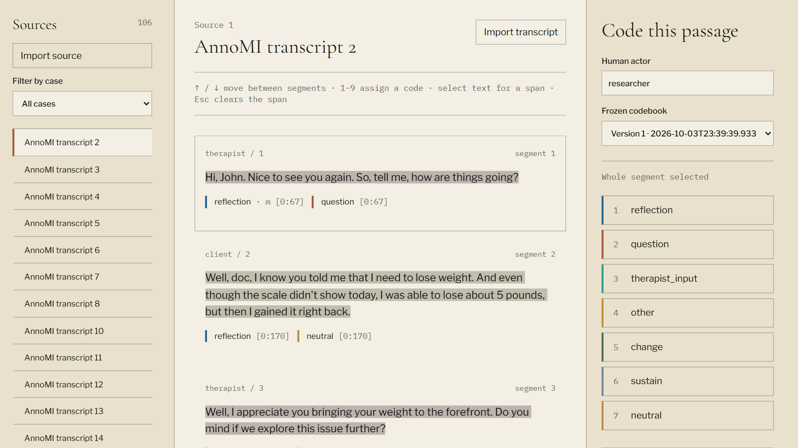

When a new idea emerges, name it from the coding panel: **Create, freeze and assign** makes the code, freezes a version and codes the passage in one step, so inductive coding no longer needs three trips to the codebook.

### Build the codebook with help, on your terms

Ask for **proposals**: new codes drafted from passages you choose (inductive), revisions of existing codes based on your review evidence, or an offline check of your own decisions that turns rejected AI suggestions into negative examples, flags unused codes and spots codes that nearly always overlap. Every AI example is checked against the passages and stored in the passage's own words; anything the passages do not contain is removed. You accept a proposal into the draft codebook, usually after editing it, or reject it with a note; both decisions are kept for your methods section.

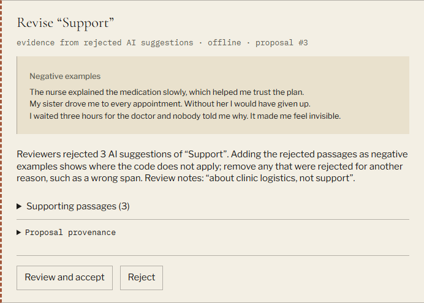

### Review AI suggestions with context

Suggestions wait in a queue grouped by reason, least certain first. Each card shows the model-reported score, why it needs review (here, a score below the project's 0.70 review threshold), the passage and the model's rationale. Press `a` to accept or `r` to reject; both decisions are kept as evidence.

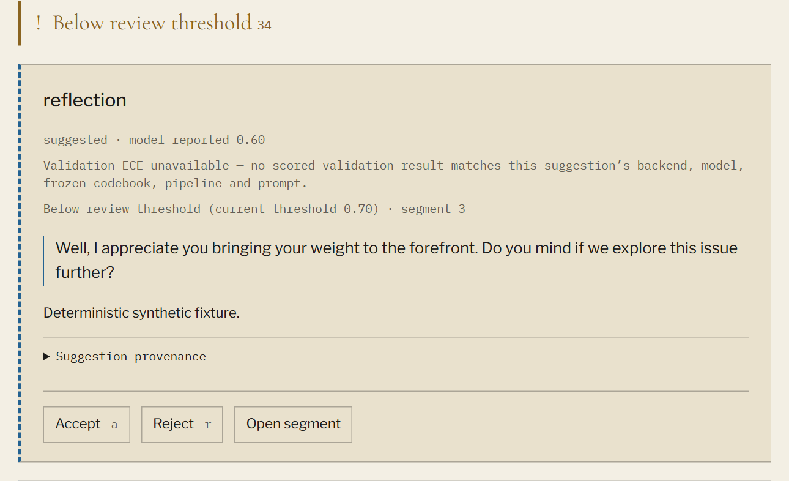

### Know how good the AI is

Evaluation compares AI codes with reference labels you supply. Each metric has a one-line explanation, agreement scores carry a cited reading ("fair", "insufficient"), and a sentence says how much of the AI's work you would need to check to reach 90% precision.

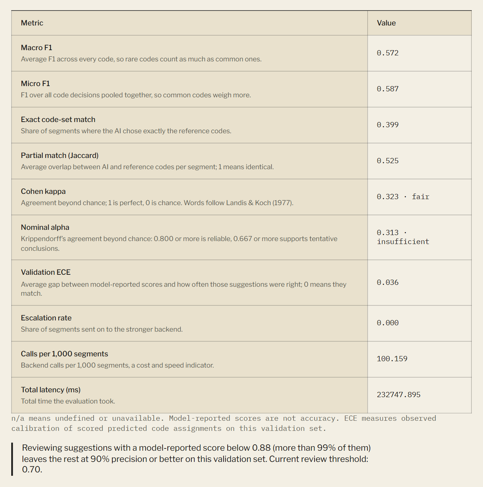

Per-code precision and recall come with 95% Wilson ranges, so a number based on a handful of examples looks as uncertain as it is. A calibration table shows how often suggestions in each score band were right.

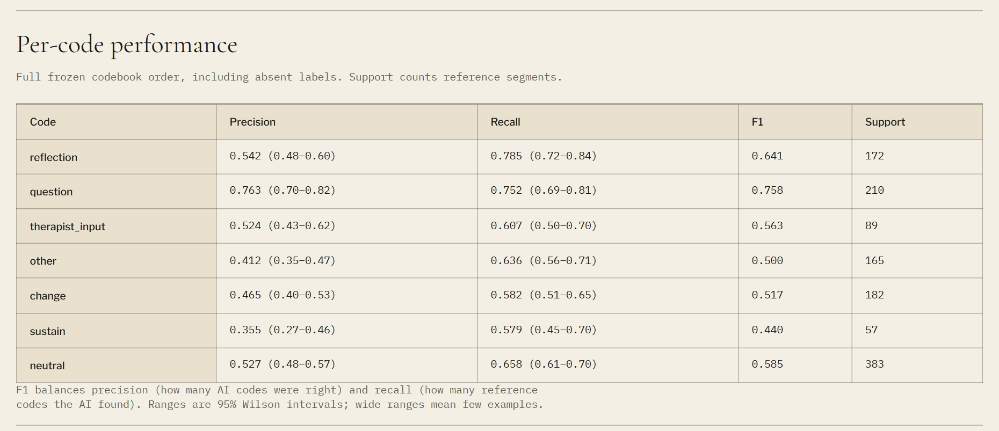

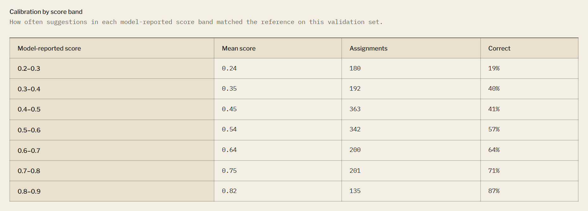

### Tune the AI without touching your methodology

**Tune thresholds** learns, for each code, the minimum score the AI needs before suggesting it, using your dev data. Qualia then measures the change on validation data and keeps it only if it helps. No AI agent is involved.

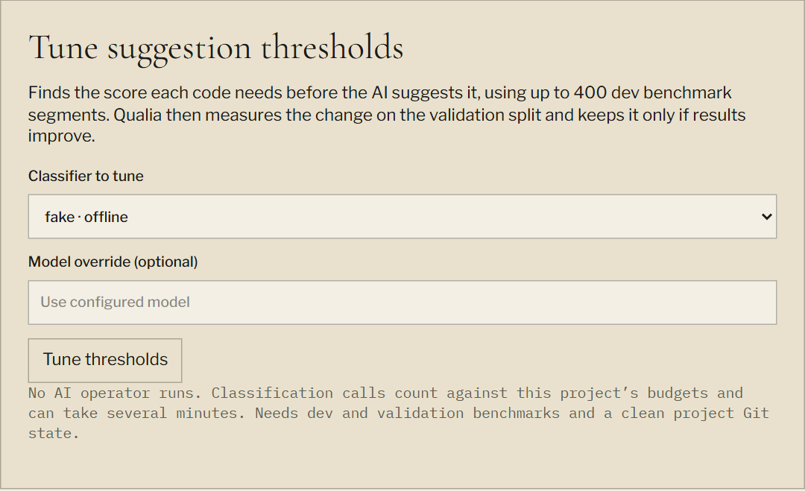

On the demo with Jev, tuning was kept on measured evidence:

| Validation (1,258 segments) | Before | After | Fresh confirmation |
|---|---:|---:|---:|
| Macro F1 | 0.523 | 0.567 | 0.572 |
| Exact code-set match | 0.365 | 0.405 | 0.399 |
| Calibration error (lower is better) | 0.050 | 0.038 | 0.036 |

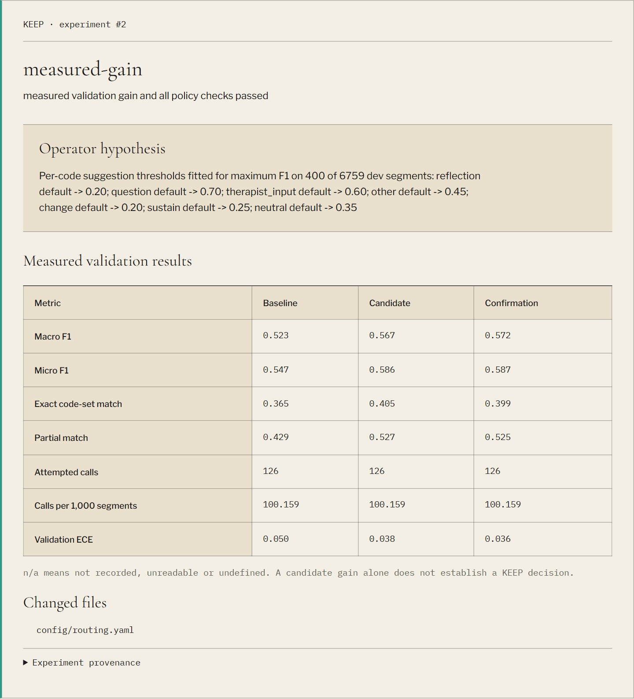

Kept thresholds appear on each code in the codebook ("AI suggests at score ≥ 0.20").

### Explore patterns and keep the evidence

The Analysis workbench gives code frequencies, group comparisons, co-occurrence, word frequency and numeric summaries. Every chart has an exact table, and every count links back to its excerpts. The matrix crosses codes with cases.

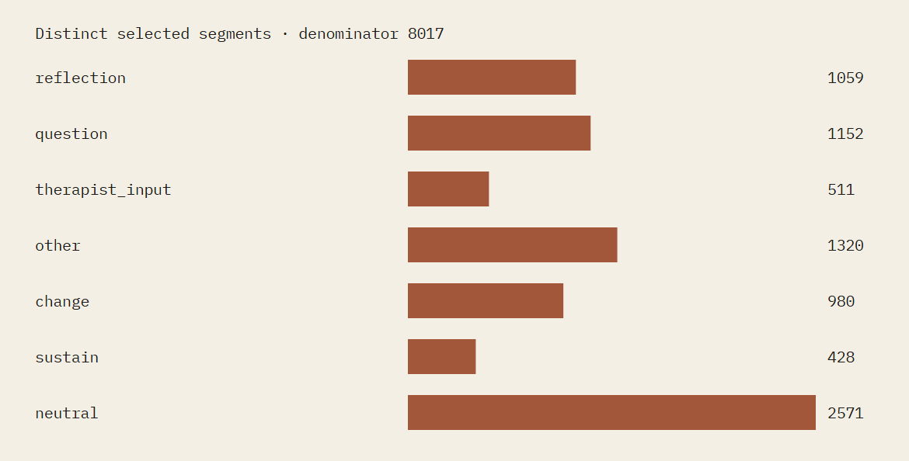

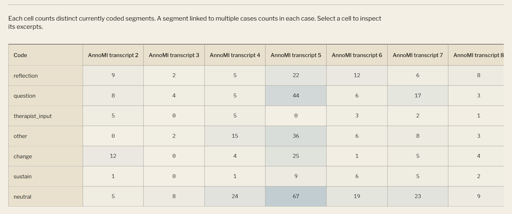

Memos have kinds (analytic, reflexive, theme, method), link to segments, codes, cases and sources, and keep every earlier version, so your reflexive record shows how your thinking changed. Retrieval and CSV, JSON, Python and R exports complete the workflow. A reproducibility bundle carries coding history, codebook versions, evaluations, experiments, usage and configuration hashes. It excludes transcript text by default.

## Get started

**On Windows (no terminal):**

1. Download `Qualia-<version>.zip` from [Releases](https://github.com/WilliamEbong/qualia/releases), right-click it → **Properties** → tick **Unblock**, and extract it to a folder you keep.
2. Double-click **Install Qualia**. It installs everything Qualia needs, adds the demo project and puts a **Qualia** icon on your Desktop and Start menu.
3. Double-click the icon whenever you want to work. Qualia opens in its own window, and closing the window shuts Qualia down.

Try Workspace, Review (choose `rules` or `fake`, both offline) and Analysis on the demo, or select **New project** to start your own study: import TXT, Markdown or CSV material, define codes and freeze a codebook version before coding.

**From source (developers, any platform):** with Python 3.14, Node 24, Git and [uv](https://docs.astral.sh/uv/):

```powershell
git clone https://github.com/WilliamEbong/qualia.git
cd qualia
uv sync
npm --prefix web ci
npm --prefix web run build
uv run python scripts/fetch_demo.py
uv run qualia demo
uv run qualia app
```

The [illustrated user guide](docs/USER-GUIDE.md) walks through every workflow step by step, including AI setup, evaluation, tuning, exports, backups and troubleshooting.

## Choose how AI helps (optional)

| Option | What you need | Cost | Good for |
|---|---|---|---|
| Manual coding | Nothing | Free | Full control, no AI at all |
| `rules` | Inclusion terms on your codes | Free, offline | A transparent keyword baseline |
| `fake` | Nothing | Free, offline | Practising the review and experiment workflow |
| Claude Code / Codex | Your own subscription sign-in on the official CLI | Your plan's usage | Rich suggestions with rationales; AI-proposed prompt improvements |
| Jev (TypeSafe) | A TypeSafe account and API key | Per input token (about $0.10 per demo validation pass) | Fast, cheap per-code probabilities; threshold tuning |

External processing is off for every new project until you allow it. Qualia never reads or stores subscription login tokens, keeps a Jev key only in an ignored local `.env`, and records every external call with its cost reservation. See [AI setup](docs/USER-GUIDE.md#12-generate-and-review-ai-suggestions) and [Jev setup](docs/USER-GUIDE.md#13-set-up-optional-jev-processing).

## Verified on the public demo

The AnnoMI demo pins commit `42936645ec3857a9c84ab296a36a3c34b779ef49` and splits whole transcripts into 6,759 development, 1,258 validation and 1,682 protected utterances. Protected text and labels live in a separate vault that improvement experiments never read.

End-to-end walkthrough:

| Step | Observed result |
|---|---:|
| Imported expert human annotations | 8,017 |
| Keyboard assignments added | 5 |
| Fake suggestions on one source | 36, from 2 calls |
| Human reviews | 1 accept, 1 reject |
| Immutable coding events afterwards | 8,060 |
| Scripted fake experiment, macro F1 (baseline → candidate → confirmation) | 0.0106 → 0.2424 → 0.2424, KEEP |
| Jev threshold tuning, macro F1 (baseline → candidate → confirmation) | 0.523 → 0.567 → 0.572, KEEP |

The fake experiment proves the measurement and audit machinery, not model quality. Its exact-match score fell while macro F1 rose, and the table keeps both. The Jev result is a real measured gain on this demo, not a guarantee for your data.

## How it works

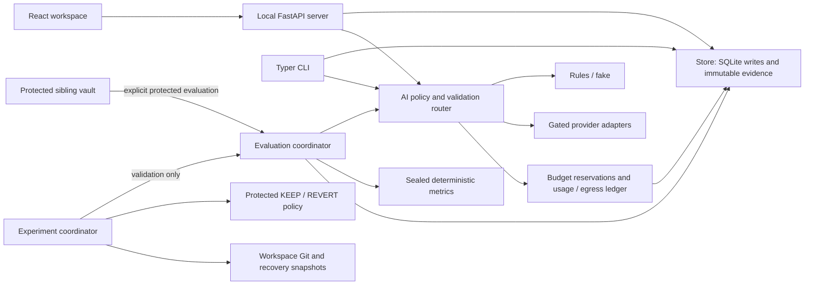

- **One database writer.** Only `qualia/store/db.py` writes. Coding, review, evaluation, usage and experiment records are append-only, enforced by SQLite triggers. Frozen codebooks are immutable.
- **Sealed metrics.** Metrics are deterministic code in `qualia/eval` built on scikit-learn and SciPy, with no database, process or network access.
- **Vendor isolation.** Each AI vendor is called from exactly one file. Classification runs without tools in an empty temporary folder, and every response is schema-validated.
- **Local by design.** Projects live outside this repository (`%USERPROFILE%\Qualia` by default). The server binds to `127.0.0.1` and requires a per-launch token.

## Data and public demonstration

[DATA-LICENSES.md](DATA-LICENSES.md) records AnnoMI's public-domain statement, citations, checksum and the limits of that evidence. Qualia's demo code definitions are attributed paraphrases. A read-only static demo of 24 licensed utterances is built from `demo/snapshot.json`. It makes no API calls and has no AI. It is published at [williamebong.github.io/qualia](https://williamebong.github.io/qualia/) by the included GitHub Pages workflow.

## Verify it yourself

```powershell
uv run pytest -m "not live"
uv run ruff check qualia tests scripts
npm --prefix web run typecheck
npm --prefix web test
npm --prefix web run build
```

The current suite passes 674 Python tests (5 platform skips; live provider tests are opt-in) and 44 web tests. CI also runs a dependency audit, a research-data guard and secret scanning. Development history, specifications and evidence are in [docs/BUILD-STATE.md](docs/BUILD-STATE.md), [specs/](specs) and [design-review/](design-review/LOOP-REPORT.md).

## Decisions

- Research workspaces have their own storage and Git history; this repository holds application code and reviewed public artifacts only.
- Human methodology, frozen codebooks, protected benchmarks and the experiment policy are outside any operator's edit scope.
- Real validation measurements decide KEEP or REVERT. Operator claims never substitute for metrics, tests or a confirming run.
- External AI and Jev are off by default. Unknown priced usage keeps its conservative reservation instead of being treated as free.
- Evaluation reports uncertainty, not bare point estimates: Wilson intervals and a review-share estimate. Agreement words (Landis & Koch; Krippendorff) are reading aids that never change a decision.
- Per-code suggestion thresholds are implementation settings, not methodology. They act on raw cached scores, so re-tuning needs no new AI calls, and only the measured policy keeps them.
- AI batches shrink to what a provider accepts instead of failing.
- Native Claude/Codex accounting counts CLI invocations and reports known tokens without claiming exact provider quotas. Jev keeps direct per-request accounting.
- Configuration uses JSON syntax (valid YAML 1.2) to avoid another parsing dependency.
- Codebook proposals are records awaiting a person's decision; accepting changes only the draft codebook. Code origin is derived from decisions rather than stored on codes, so freeze hashes stay comparable.
- Evidence proposals use your review decisions and current coding only, never evaluation metrics, so the codebook is not tuned to the measuring benchmark.
- Themes are a documented pattern (parent code plus theme memo) rather than a new object; memo history is kept by a database trigger.
- Claude Code and Codex are accepted at or above a minimum version (2.1.284 and 0.160.0) instead of one pinned version; the version used is recorded on every suggestion and usage row.
- The workspace response sends current coding as event IDs instead of a second copy of each row (the demo payload fell from 13.5 MB to 7.4 MB).
- Owner decisions are recorded with their reasoning in [docs/answers/](docs/answers).

Software: [MIT](LICENSE). Dataset provenance and permissions: [DATA-LICENSES.md](DATA-LICENSES.md).
