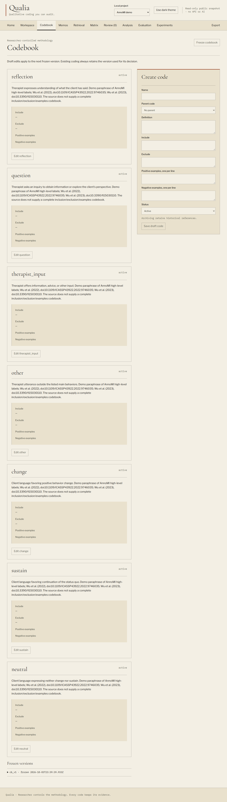
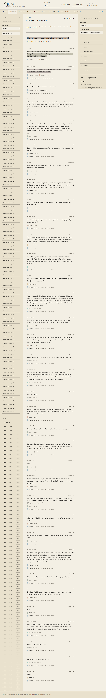
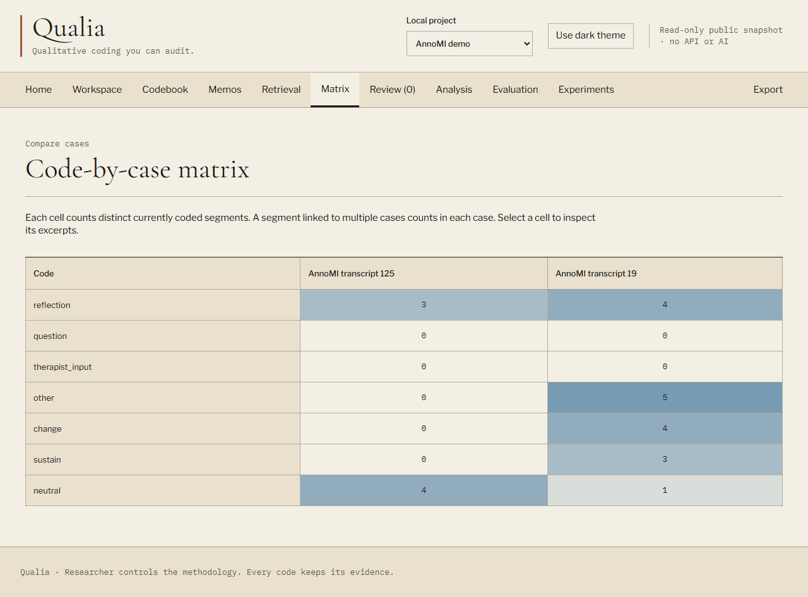

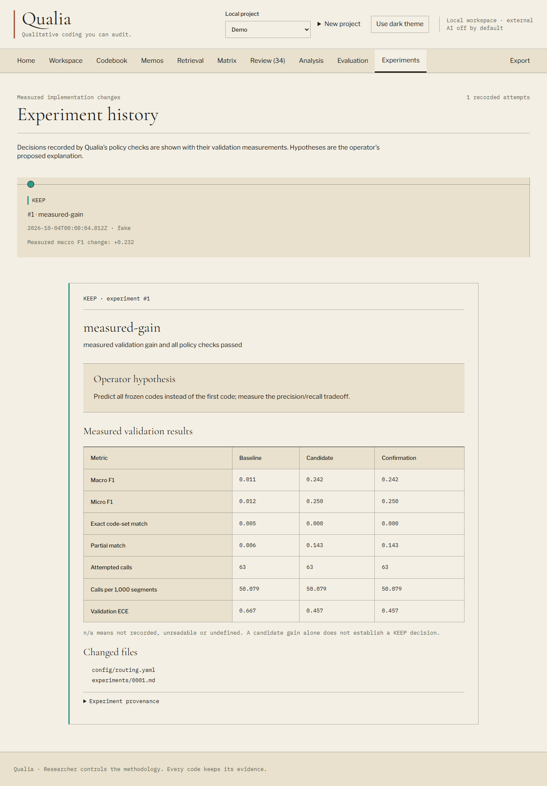
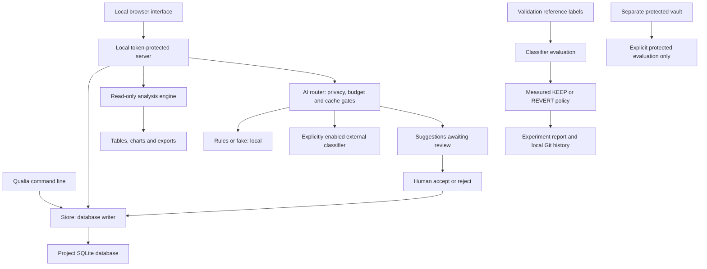

# Qualia user guide

**Qualitative coding you can audit.**

Qualia helps you read research material, apply your own codebook, keep analytic notes, compare patterns across cases, and trace results back to the passages and decisions that produced them. You can work manually without an AI account. Optional classifiers produce suggestions for you to review; they do not decide your methodology.

This guide is for a researcher using the local Windows installation. It describes implemented workflows and their limits. Availability messages in the app remain authoritative: native Claude and Codex classifiers and improvement operators are currently unavailable, and Jev requires separate setup. The optional security scanner did not complete its Windows permission preflight; this guide does not claim a completed external security audit, deployment, or remote push. See [build status](BUILD-STATE.md) for current verification and remaining work.

**Use Qualia's own browser UI for your research.** Start it with `uv run qualia open`, then use its Workspace, Codebook, Review and Analysis views. You do not need to keep an AI desktop app open. The intended native AI integration launches the installed Codex or Claude CLI as a local subprocess and lets that CLI use its existing official sign-in; it does not ask you to paste a subscription token into Qualia. That integration remains disabled until the engineering gates described in [AI backend availability](#12-generate-and-review-ai-suggestions) are resolved.

The Codebook, Matrix and Analysis illustrations below show the licensed read-only public snapshot. They explain the layout; disabled editing controls in those screenshots do not mean that editing is disabled in your local research project. The Workspace illustration shows the local AnnoMI demonstration and its coding provenance. The Review and Experiments illustrations show that local demonstration using the offline fake backend.

## Find the workflow you need

- [Understand the basic concepts](#1-understand-the-basic-concepts)
- [Install and open Qualia](#2-install-and-open-qualia)
- [Try a small practice study](#3-try-a-small-practice-study)
- [Import your material](#4-import-your-material)
- [Organize cases and attributes](#5-organize-cases-and-attributes)
- [Create and freeze a codebook](#6-create-and-freeze-a-codebook)
- [Code passages manually](#7-code-passages-manually)
- [Write memos and retrieve evidence](#8-write-memos-and-retrieve-evidence)
- [Compare codes in the matrix](#9-compare-codes-in-the-matrix)
- [Use the Analysis workbench](#10-use-the-analysis-workbench)
- [Continue in Python or R](#11-continue-in-python-or-r)
- [Generate and review AI suggestions](#12-generate-and-review-ai-suggestions)
- [Set up optional Jev processing](#13-set-up-optional-jev-processing)
- [Evaluate a classifier against reference labels](#14-evaluate-a-classifier-against-reference-labels)
- [Understand improvement experiments](#15-understand-improvement-experiments)
- [Export a project or reproducibility bundle](#16-export-a-project-or-reproducibility-bundle)
- [Understand the static demonstration](#17-understand-the-static-demonstration)
- [Back up your work and handle interruptions](#18-back-up-your-work-and-handle-interruptions)
- [Troubleshoot common problems](#19-troubleshoot-common-problems)
- [Understand how Qualia works](#20-understand-how-qualia-works)
- [Command and keyboard reference](#21-command-and-keyboard-reference)

## 1. Understand the basic concepts

| Term | Meaning in Qualia |
|---|---|
| Project | A separate local research workspace with its own material, codebook, settings and history. |
| Source | Imported text, such as an interview or a CSV text record. Source text is preserved; revised content becomes another source. |
| Segment | A passage within a source. The default import method splits text at blank lines. |
| Span | A selected part of a segment. You can code a span or the whole segment. |
| Case | Your unit of comparison: a participant, organization, site, interview or another explicitly chosen unit. A case links to sources. |
| Attribute | A named value on a case or source, such as `group=north` or `age=36`. Analysis uses case attributes. |
| Code | A researcher-defined label, with a definition and optional inclusion/exclusion rules and examples. |
| Frozen codebook | An immutable version of your code definitions. Coding decisions record which version they used. |
| Current assignment | A manual assignment or accepted suggestion that has not been removed for that exact code/span. |
| Suggestion | A proposed model code awaiting human review. It does not count as current coding. |
| Provenance | The record of who did what, on which span, using which codebook and, when applicable, which model and prompt. |
| Benchmark | Separate examples with reference labels for measuring a classifier. It is not the same as your live coding workspace. |

Qualia provides several familiar NVivo-style workflows: text coding, hierarchical codes, cases and attributes, memos, coded-text retrieval, a code-by-case matrix, text/code queries, word frequency, co-occurrence, group comparisons and descriptive numeric analysis. It does not currently import proprietary NVivo project files, code audio/video, offer unrestricted statistical modeling, or provide simultaneous multi-user collaboration. Code hierarchy organizes definitions; it does not automatically roll child codes into parent counts.

## 2. Install and open Qualia

### First installation

You need the existing Qualia application folder, Git, uv, Python 3.14 and Node 24. If a command is not recognized, install or repair that prerequisite before continuing. You do not need Claude, Codex, Jev or R for manual coding.

Open PowerShell and run:

```powershell
Set-Location "C:\Users\Owner\OneDrive\Documents\Qualia"
uv sync
npm --prefix web ci
npm --prefix web run build
```

**Expected result:** dependencies install and the web build completes without errors. These setup steps need internet access for downloads. Ordinary manual work is local after installation.

To install the larger licensed AnnoMI demonstration:

```powershell
uv run python scripts/fetch_demo.py
uv run qualia demo
```

The fetch script verifies a pinned checksum. The demo command is repeatable without duplicating the imported sources, segments or annotations. Its visible research workspace contains 8,017 utterances from 106 transcripts, with seven expert-label codes. A separate protected split stays outside the visible workspace. Dataset provenance and licensing qualifications are in [DATA-LICENSES.md](../DATA-LICENSES.md).

### Open and stop the app

```powershell
uv run qualia open
```

Keep this terminal open. The browser normally opens at `http://127.0.0.1:8765`. Choose a project under **Local project**, or open one from **Home**. Use **New project** to create a study.

To stop the local server, return to its terminal and press **Ctrl+C**. To resume later, run `uv run qualia open` again. Refresh old browser tabs after restarting because each server launch has a new access token.

If the port is occupied:

```powershell
uv run qualia open --port 8766
```

A `QUALIA_PORT` setting in your environment or local `.env` overrides the command-line port. `uv run qualia open --no-browser` starts the server without opening a browser tab.

### Where your work is stored

The application folder contains software. Research workspaces live elsewhere, by default:

```text
C:\Users\Owner\Qualia\
  projects\your-study\    database, configuration, benchmarks and project Git history
  vault\your-study\       protected benchmark material and its integrity manifest
  recovery\your-study\    recovery evidence when an experiment is interrupted
```

`QUALIA_HOME` can select another location outside the application checkout. Set it before creating projects. Changing it later selects a different storage root; it does not move existing projects. Keep the same setting across CLI commands and server launches.

For a persistent custom location, open the application's ignored `.env` in a text editor, preserve its other lines, and add or update the setting once. For example:

```dotenv
QUALIA_HOME=C:\Research\QualiaData
```

Save as `.env`, not `.env.txt`, then restart Qualia. An already-set environment variable takes precedence over this file. Keep credentials in their existing local entries; do not copy their values into a guide, command or screenshot.

The vault is an application access boundary, not encrypted storage. Your operating-system access controls and backup arrangements still matter. The local application is not a hosted collaboration service.

## 3. Try a small practice study

This synthetic exercise produces easy-to-check results without using private research data or AI.

1. In **New project**, enter `practice-study` as the **Project identifier**, then select **Create local project**. Identifiers use lowercase letters, digits and hyphens.
2. Open Notepad, paste the CSV below, and save it as `practice.csv` using **All Files** and UTF-8 encoding. Keep it outside the application folder, for example in your Documents folder.
3. In **Workspace**, choose **Import source**. Select the file and choose **CSV with column mapping** as **File format**.
4. Keep the default text/case/speaker column names. Enter `group,age,wellbeing` under **Attribute columns**. Select **Import into project**.

```csv
text,case,speaker,group,age,wellbeing
"My sister gives me support when work feels stressful.",p01,Participant,north,24,4
"I feel pressure at work and take a short walk afterward.",p02,Participant,south,36,6
"Support from friends helps me manage pressure.",p03,Participant,north,48,8
```

**Expected result:** three sources, three segments and three linked cases. The CSV row names become source names. Each participant has the mapped case attributes.

5. In **Codebook**, create `Support`, defined as “Practical or emotional help from other people.” Select **Save draft code**.
6. Create `Pressure`, defined as “Experienced demands or stress.” Save it, then select **Freeze codebook**.
7. In **Workspace**, select the first source and assign **Support** to its whole segment. Assign **Pressure** to the second source. Assign both codes to the third source.
8. Open **Analysis**. With no filters, each code should appear on two of three segments and two of three cases: approximately 66.667%.
9. Under **Analysis criteria**, set **Group by case attribute** to `group`, select `age` and `wellbeing` under **Explicit numeric case attributes**, and select **Apply analysis criteria**.

**Expected result:** north contains two cases and south one. Age has mean 36, median 36 and sample SD 12. Wellbeing has mean 6 and sample SD 2. Pearson r is 1 for these three deliberately constructed pairs. This is a software exercise, not a research finding.

Use this project to practice removal, memos, filters and exports. Keep actual research in a separate project.

## 4. Import your material

### Text or Markdown

1. Select the correct **Local project**.
2. In **Workspace**, choose **Import source** or **Import transcript**.
3. Choose a `.txt` or `.md` file, or paste text into **Or paste source text**. Use UTF-8 files.
4. Set **File format** explicitly and optionally provide a **Source name**.
5. Leave **Source version** as **New source** for a new document.
6. Select **Import into project**, then inspect the segments before coding.

Blank-line paragraphs are the default segments. For intentional advanced changes, `config/segmentation.yaml` supports `paragraph`, `utterance` and `sentence`. Configuration files use JSON syntax despite their `.yaml` extension. Utterance mode splits lines and can recognize `Speaker: text`; sentence mode splits at whitespace after `.`, `!` or `?` and does not infer abbreviations. There is no segmentation settings screen. Existing imported sources are not resegmented by changing a configuration file.

### CSV mapping

Use one text record per row and a header row. In **CSV column mapping**, match the exact case-sensitive column names:

- **Text column:** required text content.
- **Case column:** optional case name; repeated names link records to the same case.
- **Speaker column:** optional speaker label.
- **Attribute columns:** comma-separated column names you explicitly want to import.

If a row has a case, its mapped attributes belong to that case. Without a case, they belong to the source and are not available for case-group or numeric analysis. A speaker label alone does not create a case. Repeated rows for one case update its named attributes; import case measurements consistently rather than treating each row as another numeric observation.

The full file validates before database insertion. A malformed row, missing mapped attribute column or invalid text rejects the import with a filename/row message.

### Reimporting and revisions

Identical source content is imported once, even if you select it again. A repeat can report **0 new sources**; it may still attach explicitly supplied case metadata. To import changed text as a revision, choose the existing source under **Source version**. Old source text and coding remain available; coding is not automatically transferred to a new text version.

CLI equivalent:

```powershell
uv run qualia import "C:\Research\interviews.csv" --project my-study --text-column response --case-column participant --speaker-column speaker --attribute-columns "region,age"
```

Use `--version-of SOURCE_ID` for an explicit revision. Replace example paths, project names and IDs with your own.

## 5. Organize cases and attributes

A source can link to more than one case. Each linked case receives that source's selected segments in case-based analyses. This is useful for some designs, but it does not separate participants inside a multi-speaker transcript automatically.

1. In **Workspace**, select **Create case**, or **Edit** beside an existing case.
2. Enter **Case name**.
3. Under **Add linked sources**, select the sources belonging to that case. Existing links are checked and disabled because they cannot be removed in this form.
4. Enter **Attributes, one name=value per line**, for example:

```text
region=north
age=36
wellbeing=6
```

5. Select **Save case**. Use **Filter by case** to inspect its linked sources.

**Editing is additive:** existing links remain attached; link removal is not currently supported. Submitted attribute values update their named attributes. Omitted attributes remain. To mark a value missing, submit an empty value such as `age=`. This does not delete the attribute key.

Choose units deliberately. Numeric analysis uses one observation per eligible case, not per segment or source. A source shared by several cases can contribute to several groups, so group totals and percentages are not necessarily additive or independent.

## 6. Create and freeze a codebook

1. Open **Codebook**.
2. Under **Create code**, enter a **Name** and **Definition**.
3. Optionally choose a **Parent code**, write **Include** and **Exclude** guidance, and add positive/negative examples, one per line.
4. Leave **Status** as **Active** and select **Save draft code**.
5. Repeat for the rest of your codebook.
6. Select **Freeze codebook** when the definitions are ready for use.

**Expected result:** an immutable version appears in the codebook history and in the **Frozen codebook** selector in Workspace. You need an active code and a frozen version before coding.

Later edits change the draft. Select **Edit [code name]**, save your changes, then freeze a new version. Existing decisions retain their original version and historical code name. The Analysis frequency table uses current display names and identifies the frozen versions contributing to its counts.

Archiving a draft code preserves historical references. Freeze a new version to exclude an archived code from that version's active coding choices. Selecting an older frozen version still exposes its historical active codes.

Your codebook belongs to you. AI classification and improvement experiments do not edit code definitions or frozen methodology.



Use this view to inspect definitions before choosing a frozen version for coding.

## 7. Code passages manually

### Whole segments and selected spans

1. Open **Workspace** and select a source.
2. Under **Code this passage**, enter your **Human actor** name or research identifier.
3. Choose the intended **Frozen codebook** version.
4. Click a segment. With no selected text, the panel says **Whole segment selected**.
5. Click a code button. Wait until saving finishes before the next action.
6. To code only part of a passage, select its text, confirm the displayed **Selected span**, then click a code.

**Expected result:** a current code mark appears with its span. **Current assignments** shows the coded excerpt. **Provenance** records actor, action, time, frozen version and pipeline identity. Multiple codes can apply to the same passage.

Use **Use whole segment** or Escape to clear a text selection. Arrow keys move through the current source; keys 1–9 apply the corresponding displayed code, not a database code ID. Shortcuts do not operate while you are typing into a form.



Work from left to right: choose the source, read/select the passage, then inspect its coding and provenance. Wait until code buttons are enabled after saving before pressing the next coding shortcut.

### Correcting a decision

Select the segment, find the assignment under **Current assignments**, and choose **Remove assignment**. The current assignment disappears, but its original event and the removal remain in **Provenance**. You can then assign the appropriate code/span. This is an audit trail, not a destructive undo.

### Understanding span numbers

Offsets are relative to the segment and count Unicode code points. `0:5` includes positions 0 through 4, excluding position 5. The UI handles the conversion from browser selection offsets. For CLI work with emoji or combining characters, do not assume the displayed glyph count equals the required offset; UI selection is usually easier.

## 8. Write memos and retrieve evidence

### Memos

1. Open **Memos** and choose **New memo**.
2. Enter **Title** and **Memo** text.
3. Optionally choose a **Linked segment** and/or **Linked code**.
4. Select **Save memo**.

Use memos for interpretations, questions, exceptions and methodological decisions. **Edit memo** updates the memo; memo editing is not the same immutable event history used for coding decisions.

### Retrieval

1. Open **Retrieval**.
2. Select a **Code**, a **Case**, or both. Leave them at **All codes**/**All cases** for a broader view.
3. Read the matching coded excerpts and their frozen codebook versions.
4. Choose **Open in transcript** to inspect context.

Retrieval lists current coded spans. Several spans in one segment can produce several excerpt cards. Segment-frequency analyses and the matrix deduplicate those spans when counting presence.

## 9. Compare codes in the matrix

1. Ensure you have cases linked to sources and current coding assignments.
2. Open **Matrix**.
3. Read each code-by-case cell as the number of distinct currently coded segments carrying that code and linked to that case.
4. Select a cell to open the corresponding retrieval view.

Repeated spans of the same code on one segment count once in a cell. Multi-case source links contribute to each applicable case. An empty matrix can mean no case links, not necessarily no coding.



Use a cell as a route back to the supporting coded excerpts, not as a standalone explanation of the pattern.

## 10. Use the Analysis workbench

Analysis reads visible workspace data. It does not write coding, call AI or read the protected benchmark vault. It describes the data and decisions selected by your criteria; it does not establish statistical significance or causation.



Set the criteria first, read the denominators and methods, then use the evidence links or exports to inspect the result.

### Select and apply criteria

1. Open **Analysis**. The first report uses all visible segments.
2. Expand **Analysis criteria** if needed.
3. Choose **Analysis source** and/or **Analysis case** to narrow the scope.
4. Enter a **Literal text query** if useful. It is a case-insensitive substring search, not a regular expression; `.*` searches for those literal characters.
5. Expand **Code filter**, select codes, then choose **Any selected code** or **All selected codes** under **Match selected codes**. No code selection imposes no code filter.
6. Choose any grouping, numeric or word options described below.
7. Select **Apply analysis criteria**.

All filter types intersect. Selecting a code filters which segments enter the report; the frequency table still describes all current codes on those segments. **Applied criteria** records the effective choices. Entering Analysis, selecting **Refresh analysis**, or selecting **Apply analysis criteria** first reloads the workspace, then calculates the report using that fresh evidence snapshot. Entry and Refresh preserve the last applied criteria for that project; Apply uses your current form choices. Switching projects resets criteria to the defaults. Refresh does not apply unsaved form changes.

Wait for the fresh report after changing coding or attributes. If you made changes through a CLI command or another browser tab, select **Refresh analysis** to reload both the workspace evidence and the report while preserving your applied criteria. A full browser reload is not required for this update. Qualia does not continuously synchronize edits from other processes, so refresh before interpreting externally changed data.

Browser report downloads send the displayed report's input hash along with its applied criteria. The server recomputes the report and rejects the download if the underlying data/configuration has changed, with **Research data changed. Refresh analysis before downloading this report.** Refresh, inspect the new report, and download the related files again as a set. Previously downloaded files are not updated automatically.

### Code frequencies and group comparisons

Read **Code frequencies** as presence: each segment and linked case counts at most once per code. The displayed denominators are the selected segments and eligible linked cases, including those without the code. Uncoded selected segments remain in the segment denominator. Percentages with an empty denominator are displayed as zero.

Select a bar or count to open its **Source evidence**. Under **Coding evidence**, inspect event IDs, historical names, actors, spans and frozen versions. **Open transcript** returns to the source. Evidence pages show up to 25 segments; pagination and complete selected IDs remain available even though the API's embedded excerpt list is capped.

To compare groups, choose **Group by case attribute**, apply the criteria, then expand a group under **Case-group comparisons**. Missing values and conflicting values appear separately. Equal nonblank values collapse, surrounding whitespace is trimmed, and differing nonblank values conflict. Only case attributes are used. Group percentages use that group's own segment/case denominators.

### Co-occurrence

Choose one **Co-occurrence unit**:

- **Present in the same segment:** count a segment once if it carries both codes anywhere.
- **Positive-length span overlap:** count it once only if their coded spans actually overlap. Touching end/start boundaries do not overlap.

The heat table shows mode counts; selecting a cell opens contributing evidence. **Exact pair counts and segment-presence Jaccard** provides exact values. Jaccard is always the number of segments carrying both codes divided by the number carrying either code, regardless of overlap mode. Consequently, an overlap count can be zero while segment-presence Jaccard is positive. These are different quantities.

### Word frequency

Under **Word-frequency options**, set **Minimum word length**, **Top words** and **Explicit stopwords**, separated by spaces or commas. Apply the criteria.

**Words in selected text** distinguishes occurrences from distinct segments. For example, a word repeated five times in one segment has five occurrences and segment frequency one. Tokenization uses Unicode casefolded letters and internal straight/curly apostrophes. Digits and other punctuation delimit tokens. There are no hidden stopwords, stemming or automatic synonym groups. The word list is descriptive and is not a substitute for reading context.

### Numeric summaries and scatter plots

1. Under **Explicit numeric case attributes**, choose up to eight fields that you intend to treat as measurements.
2. Apply the criteria.
3. Inspect **Valid**, **Missing**, and **Invalid / conflicting** before interpreting mean, median, sample SD, minimum or maximum.
4. With two or more selected fields, choose a pair under **Scatter fields**.
5. Inspect **Paired cases**, **Pearson r**, **Exact paired case values**, and **All pairwise correlations**. Select a point or case row to inspect its selected source evidence.

Numeric parsing accepts finite decimal/scientific strings such as `24`, `-2.5` and `1.2e3`, with absolute magnitude at most `1e150`. Blank values are missing. `NaN`, `Infinity`, `1,000`, nonnumeric text and conflicting values are invalid. Categorical numbers and participant IDs are not automatically treated as continuous measurements; make that decision explicitly.

Sample SD uses the sample denominator, n−1, and requires at least two valid values. Pearson uses only cases valid on both fields. It requires at least three pairs and two nonconstant fields; otherwise it is **n/a**. A missing observation is not silently turned into zero. Shared sources and linked cases may violate assumptions needed for later inferential analyses; Qualia reports descriptive relationships, not p-values or causal conclusions.

### Save charts and provenance

The following illustration uses six invented cases, including one invalid age value, to show the numeric relationship workflow. It is separate from the AnnoMI demo and the small practice study above.


Use **Download frequency SVG** or **Download scatter SVG** for standalone charts with labels and criteria. Exact values remain in adjacent tables. Chart labels and SVGs can contain research metadata, so review them before sharing.

**Analysis methods and provenance** records the input hash, pipeline, contributing event IDs and frozen codebooks. Default analysis JSON omits words and source excerpts, but retains the report criteria and research metadata.

### Analysis limits

The engine accepts at most 20,000 input segments, 5,000 cases, 200 codes, 100,000 current coding rows, 50,000 attributes and 100,000 source-case links. Source/case filtering can reduce computation and result sizes, but does not bypass these whole-project input caps.

Additional limits bound text processing, case/attribute expansion, word/pair memberships, frequency outputs and span comparisons. If a limit is reached, the report fails explicitly rather than silently dropping contributions. Use a smaller source/case scope for a computation limit, or a smaller separately imported project for a whole-project limit. The precise limits are included in report methods.

## 11. Continue in Python or R

Use this workflow for deeper analysis outside Qualia. It does not install or execute an unrestricted code runner in the application.

1. Set the intended Analysis criteria, including numeric fields, and select **Apply analysis criteria**.
2. Select **Download case CSV**.
3. Select **Download analysis JSON** to retain criteria, input identity and the column dictionary.
4. Select **Download Python starter** and/or **Download R starter** from the same report. If a download reports changed research data, refresh the analysis, review it, and download all related files again so the set uses one input identity.
5. Keep those files together in a research output folder. Review them before running.

Downloads use these names:

```text
qualia-analysis.csv
qualia-analysis.json
qualia-analysis.py
qualia-analysis.R
```

CSV has one row per eligible case. `code_ID` columns count distinct selected segments for that case. Attribute columns use stable IDs rather than embedding arbitrary field names. The JSON dictionary and starter metadata explain them. Status columns distinguish present, missing and conflicting values. Spreadsheet formula-leading strings are escaped; explicit flags let the starter recover exactly the added escape character.

From the output folder, run a starter deliberately:

```powershell
python qualia-analysis.py qualia-analysis.csv
Rscript qualia-analysis.R qualia-analysis.csv
```

The Python starter requires Python 3.10+ and only its standard library. The R starter uses base R; R must be installed separately. The Python workflow has executable regression coverage. R source has been reviewed, but R was not installed in the verified environment, so its execution is not claimed here.

The starters reproduce selected numeric summaries, pairwise correlations and case-level code prevalence. They do not reconstruct source excerpts or every segment-level chart from a case table. Mismatched CSV columns cause a clear failure: re-download the CSV and script together instead of editing away the check.

**Privacy:** Analysis exports omit source text, but retain case names, attributes and query criteria. This is not anonymization. The workspace Export workflow has a different default, explained below.

## 12. Generate and review AI suggestions

### Know which backend you are using

| Backend | Current behavior |
|---|---|
| `rules` | Offline keyword baseline. Matches comma/newline-separated inclusion terms, or the code name when inclusion text is empty, as case-insensitive substrings. It does not interpret your full methodology. |
| `fake` | Offline deterministic demonstration. Proposes configured first/all/no codes with a synthetic rationale. It is not a trained model or a research-quality recommendation system. |
| `claude`, `codex` | Currently unavailable for production classification and improvement. Logging in does not resolve the request-accounting/confinement gates. |
| `jev` | Optional external classifier, installed but off by default. Requires a locally configured key, project opt-in and a deliberate backend choice. |

**What has actually been tested:** the recorded [synthetic CLI preflight](research/preflight-ai.md) successfully called Codex `gpt-6-luna` twice on a tiny invented classification and completed a `gpt-6-astra` delegation probe. Claude returned an authenticated quota-limit response, so that preflight did not establish successful Claude generation. These were direct CLI diagnostics, not successful calls through Qualia's production integration. Later [adapter checks](research/cli-classification.md) identified unresolved per-request accounting, generation-limit and operator-isolation requirements; logging in or opening an AI desktop app does not remove those gates. The [subscription documentation review](research/subscription-policy.md) explains the narrower documented native-login use without claiming provider approval of every integration.

### Generate a small batch

1. Freeze your codebook and select a source in **Workspace**.
2. Open **Review**.
3. Choose **Backend**. Use `rules` for a local keyword baseline, or `fake` only to practice the review workflow.
4. Choose **Current source** under **Scope**. The large AnnoMI demo exceeds the default 2,000-segment run limit when all project segments are selected.
5. Leave **Model override (optional)** empty unless you have a verified reason to set it.
6. Select **Run classification**, then inspect the result and pending suggestions.

Classification uses the project's **latest frozen codebook** and budget/privacy policy; the Workspace selector for manual coding does not select an older classification codebook. An empty result can mean no matching rules, not a failure. Cache reuse may reduce new calls; it does not make a suggestion a human decision. Large or unsupported segments can be rejected explicitly rather than silently shortened.

### Review carefully

[Open the illustrated Review view](../design-review/final/review-1280.png). The full-page example shows a fake suggestion queue; use the rationale, excerpt and provenance together before making a decision.

1. Enter your **Reviewer** identity.
2. Select a suggestion, read its excerpt and rationale, and use **Open segment** for context.
3. Inspect **Suggestion provenance** and any calibration caption.
4. Optionally enter a **Review note**.
5. Choose **Accept** or **Reject**, or use `a`/`r` while the suggestion is selected and you are not typing in a field.

Acceptance creates a current coding decision with the original model identity and human reviewer. Rejection does not create a current assignment. Both decisions append review evidence; the original suggestion remains in history. A suggestion can appear under several review reasons, but reviewing it resolves that suggestion once.

Numbers labeled **model-reported** are not measured accuracy. Rules and fake scores are deterministic fixture values. A validation ECE caption appears only when backend, model, frozen codebook, pipeline and prompt identities match a scored validation run. An unavailable ECE is not evidence of perfect calibration.

To inspect availability without starting classification:

```powershell
uv run qualia availability --project my-study
```

## 13. Set up optional Jev processing

Follow the detailed [Jev setup guide](JEV-SETUP.md). It covers your TypeSafe account, credits, dedicated key, ignored local `.env`, and a tiny synthetic first request. An account alone does not verify a usable balance or authenticated API access.

Keep the key out of chat, screenshots, source code, shell command history and frontend settings. Save it locally as described in that guide. Qualia never needs you to paste a subscription login token.

Check local readiness:

```powershell
uv run qualia jev check --project my-study
```

This makes zero network requests. `key_configured: true` means a key is present, not that billing or authentication succeeded. To deliberately permit external AI and Jev for one project:

```powershell
uv run qualia jev enable --project my-study
```

Use the separate synthetic project in the setup guide before sending research material. Enabling changes that project's policy while preserving budgets; it does not classify anything by itself or enable other projects. To turn it off:

```powershell
uv run qualia jev disable --project my-study
```

External processing is a research-data disclosure decision. Review participant consent, your data-handling requirements and provider terms. Local budget reservations limit requests but do not configure provider billing or establish data-retention guarantees. Unknown actual costs retain a conservative reservation rather than being treated as free.

## 14. Evaluate a classifier against reference labels

**Analysis** describes your current research coding and attributes. **Evaluation** measures classifier predictions against separately supplied reference labels. Evaluation never turns its predictions into research coding assignments.

### Use the demo validation benchmark

1. Select the locally installed `demo` project.
2. Open **Evaluation**.
3. Under **Evaluate validation split**, select an available **Evaluation backend**.
4. Select **Run validation evaluation**.
5. Inspect the **Recorded validation run**, aggregate metrics, **Per-code performance**, and **Evaluation provenance and metric definitions**.

The demo validation split contains 1,258 utterances. Privacy and call budgets still apply. Successful evaluation requires complete coverage; the UI does not invent partial metrics when a run fails.

Read macro/micro F1, exact code-set match, partial match and per-code support together. They answer different questions. The displayed alpha basis distinguishes human-coder agreement from reference-versus-prediction agreement; the latter is not human intercoder reliability. **n/a** means undefined or unavailable.

### Import your own benchmark

This is an advanced workflow. Prepare UTF-8 JSONL, one record per line, bound to a frozen codebook. For example:

```json
{"segment_id":"validation-001","text":"A synthetic example passage.","codes":[1],"transcript_id":"interview-001"}
```

Code IDs must exist in the selected frozen codebook. Segment IDs must be unique; transcripts cannot overlap splits. Optional `coders` arrays can contain coder code-ID lists or missing ratings. Choose gold labels through your research process rather than generating them from the classifier you are evaluating.

```powershell
uv run qualia benchmark import "C:\Research\validation.jsonl" --project my-study --split validation --version 1
uv run qualia evaluate --project my-study --backend rules --output "C:\Research\evaluation-reports"
```

Replace the example version with your actual frozen version. Reimporting identical bytes is a no-op; replacing an existing split with changed content is rejected. CLI evaluation writes JSON and Markdown reports to the output directory. Without `--output`, they go in the workspace's `reports` folder.

### Protected evaluation

Protected examples are held separately so normal analysis and improvement do not inspect them. Only deliberate advanced CLI evaluation uses them:

```powershell
uv run qualia evaluate --project my-study --protected --backend rules --output "C:\Research\protected-evaluation-reports"
```

Use `--protected` without `--split protected`. A protected benchmark must already exist with a valid manifest. Normal UI views do not expose its records. Protected predictions stay in the vault; ordinary storage retains aggregate evaluation evidence. Keep output reports under your research-data controls as well.

## 15. Understand improvement experiments

An experiment proposes a change to implementation configuration/prompts, measures it on validation data, and records **KEEP** or **REVERT**. It does not authorize changing research code definitions, benchmark labels, methodology or protected test data.

The currently usable demonstration operator is `fake`. Native Claude and Codex operators remain unavailable. The CLI's default agent is Claude, so specify fake explicitly for this demonstration:

```powershell
uv run qualia improve --project demo --agent fake --budget 1
uv run qualia history --project demo
```

**Prerequisites:** a prepared validation benchmark, sufficient remaining call budget, and a clean project Git baseline. Check that you have not left uncommitted configuration or report files in the research workspace. Do not delete research files or use destructive Git commands to make an error disappear; save and review the intended changes first. Writing evaluation exports outside the workspace helps keep its experiment baseline clean.

The fake operator makes a scripted change to fake classification behavior. A gain verifies the measured experiment workflow; it is not model training or proof of better qualitative judgment. Repeating it after the change is already present may correctly produce REVERT.

In **Experiments**, choose an attempt and read **Operator hypothesis**, **Measured validation results**, **Changed files** and **Experiment provenance**. Compare baseline, candidate and fresh confirmation. A candidate gain alone is insufficient: trusted policy also checks constraints and tests. Accepted changes receive a local commit/tag; rejected attempts retain their report and measurements.

The fake demonstration previously increased macro F1 while reducing exact code-set match. This illustrates why one improved metric is not a blanket quality claim. Inspect the complete comparison and decide whether the methodology is appropriate for your study.



Read the recorded decision alongside the full metric table. In this example, the displayed macro F1 rises from 0.011 to 0.242 while exact code-set match falls to zero; the screenshot demonstrates the audit workflow, not trained-model quality.

An interrupted operation can leave a pending recovery journal. Stop and use the recovery guidance below; do not bypass the lock or manually declare the experiment complete.

## 16. Export a project or reproducibility bundle

1. Select **Export** in the navigation.
2. Choose **JSON** or **CSV** under **Format**.
3. Leave **Include source text and excerpts** unchecked for the default redacted export.
4. Check **Reproducibility bundle** if you need experiment, evaluation, usage and egress evidence alongside research provenance.
5. Select **Download export** and review the resulting file before sharing it.

| Export | Included / excluded |
|---|---|
| Workspace export, default | Retains structured identities, coding history and provenance; excludes source text and free-text content, and redacts attribute values. Names and identifiers can still be sensitive. |
| Workspace export with text | Includes research text and textual definitions/notes. Treat it as research material. Evaluation prediction payloads and protected benchmark contents remain excluded. |
| Reproducibility bundle | Adds experiment/evaluation/usage/egress records and configuration hashes. It does not package raw prompt files, credentials or vault contents. |
| Analysis JSON/CSV/starters | Excludes source transcripts, but retains case metadata, selected query criteria and explicit attribute values for analysis. |
| Static demo export | Contains the approved public snapshot and its attribution, including that snapshot's public excerpts. |

A no-text frozen-codebook snapshot retains its original hash and is marked redacted; the hash identifies the original version, not the shortened copy. Include text when you intentionally need textual code definitions for reproduction. Even a text-inclusive bundle is not a full workspace backup or an automatically restorable project; there is no general bundle-import command.

CLI example:

```powershell
uv run qualia export --project my-study --bundle reproducibility --output "C:\Research\study-bundle.json"
```

Use `--include-text` only when you intentionally want the more sensitive export. General exports support `--output`; Analysis CLI prints its selected format and currently has no `--output` option. Browser Analysis downloads avoid PowerShell 5.1 redirection encoding pitfalls.

## 17. Understand the static demonstration

The static demonstration is an approved public-data snapshot, separate from your local research workspaces. Its subset contains 24 utterances from two dev transcripts with attribution. It is not a live view of your projects, private experiments or protected vault.

You can navigate sources, inspect saved coding/provenance, retrieve evidence, view the matrix, explore its fixed Analysis report and download its precomputed exports. Analysis filters are disabled because the report scope is fixed. Creating projects, importing, coding, reviewing, classifying and evaluating are unavailable. The adapter serves the snapshot locally in the browser without API requests.

Do not confuse the smaller static snapshot with the editable local `demo` project. Publishing is a separate owner decision; the existence of a local static build does not mean a public site has been deployed.

## 18. Back up your work and handle interruptions

### Make a complete manual backup

There is no `qualia backup` or `qualia restore` command. The application's internal SQLite backup facility supports trusted operations, but it is not a general user-facing backup tool.

For a straightforward complete backup:

1. Finish any running import, evaluation or experiment.
2. Stop the server with Ctrl+C and ensure all other Qualia CLI operations have finished. Closing the browser alone does not stop the server.
3. Locate the actual `QUALIA_HOME` folder. By default it is `C:\Users\Owner\Qualia`.
4. Copy the **entire folder** to a new dated backup location using File Explorer or your approved backup software. Include `projects`, `vault`, any `recovery` folder, hidden project `.git` directories and all database sidecar files that are present. Do not copy just `project.db` while the app is running.
5. Check that the backup contains the expected project folders and files. Keep the original untouched until a recovery copy has been checked.
6. Protect the backup as research data. Your application-folder `.env` is separate; keep any key in your password manager or approved secret backup rather than distributing it with a study export.

Git history does not back up the research database or vault. JSON/CSV exports are useful evidence copies but are not a substitute for this full-folder backup.

To inspect a backup, keep all running instances stopped, work from a separate copy, and select that copy as `QUALIA_HOME` for a new launch. Do not overwrite a live workspace. Preserve the original while checking that projects, sources, coding and expected history appear. Application/schema upgrades can modify a restored copy on opening; keep the untouched backup too.

### Interrupted experiments and recovery

Messages such as **active or interrupted operation**, **pending recovery**, or **interrupted operation requiring recovery** intentionally block normal writes. They may accompany:

```text
projects\your-study\.qualia-operation.lock
recovery\your-study\pending.json
```

1. Check whether an operation is still running; do not start a second one.
2. If it has stopped, preserve the whole workspace and recovery directory before seeking help.
3. Report the exact sanitized error and project identifier. Do not post credentials, transcripts or vault contents.
4. Have the recovery journal, snapshot integrity and Git/database state inspected together before restoring or finalizing anything.

There is no one-command recovery workflow. Do not delete the journal, lock, database sidecars or snapshot to bypass the error. A recovery failure must remain visible rather than being reported as a consistent completed experiment.

## 19. Troubleshoot common problems

| Symptom | Check and next action |
|---|---|
| `uv`, `node`, `npm` or `git` is not recognized | Install/repair that prerequisite, then open a new PowerShell window. Run commands from the application folder. |
| Browser cannot connect | Keep the `qualia open` terminal running; use its local URL. Check the port or `QUALIA_PORT`. |
| Requests fail after restarting | Refresh the page so it receives the current per-launch token. Do not copy tokens into URLs or browser storage. |
| Project missing | Check **Local project**, `uv run qualia list`, and that server/CLI use the same `QUALIA_HOME`. Changing the setting does not move data. |
| Invalid project identifier | Use lowercase letters/digits separated by hyphens. Windows reserved names are rejected. |
| Import rejected | Check UTF-8 encoding, selected format, exact CSV headers/mappings, nonblank text and the reported row. No partial import is committed. |
| Repeat import reports zero sources | Identical content is deduplicated. Use revised text and explicit source lineage when appropriate. |
| Codes unavailable in Workspace | Save active draft codes and freeze a version; choose that frozen version. |
| Old code name remains on a passage | Its decision retains the historical frozen name. New draft names do not rewrite old provenance. |
| Matrix/group comparison is empty | Link sources to cases and supply case attributes; source attributes are not inherited into case analyses. |
| Removing a case link/attribute seems ineffective | Links are additive. Omitted attributes remain; submit `name=` to mark missing. Link removal is unsupported. |
| Numeric field is invalid or n/a | Inspect missing/conflicting values, decimal formatting, sample size and constant fields. Select measurements explicitly. |
| Analysis export says research data changed | The displayed input hash no longer matches current data/configuration. Select **Refresh analysis** to reload the workspace evidence and report, review the result, then download the complete CSV/JSON/starter set again. This also brings in edits from another CLI/tab. |
| Analysis exceeds a budget | Narrow source/case scope, or use a smaller project when an input-table cap is exceeded. Counts are never silently truncated. |
| Static controls are disabled | You are viewing the fixed public snapshot. Use the local app for editing or new analysis criteria. |
| AI unavailable | Read **Backend availability and privacy** or run `availability`. Native gates are intentional; signing in alone does not enable them. |
| Classification run too large | Choose **Current source** or pass explicit `--segments`; default whole-run limit is 2,000 segments. |
| No rules suggestions | Inclusion terms/name did not match. Rules perform literal keyword matching, not semantic coding. |
| A suggestion appears in several groups | It has several review reasons. Reviewing its ID resolves the same suggestion across groups. |
| No ECE caption | No scored validation run matches the suggestion's full identity. Do not interpret missing calibration as accuracy. |
| Jev key present but requests fail | `jev check` does not validate billing/authentication. Follow the setup guide and share only sanitized error status. |
| Experiment refuses dirty Git state | Review intended workspace changes. Keep reports outside the workspace or deliberately save them; do not discard research to clear the error. |
| R command unavailable | Install R separately if needed, or use the Python starter. R execution was not verified in the installed environment. |
| Pending recovery or lock | Follow the preservation steps above; do not delete the detector files. |

## 20. Understand how Qualia works



The browser connects to a server bound to `127.0.0.1`. The server validates requests and carries a token in browser memory. A single Store layer writes the database; coding decisions, review feedback, evaluation/experiment evidence, usage records and frozen codebooks are protected as immutable history. Draft codes, cases, attributes and memos remain editable through their supported workflows.

Classification records the frozen codebook, model/prompt identity and spans. Every external attempt must pass privacy and budget admission before dispatch. Analysis uses the current visible snapshot and returns contributing IDs and hashes. Evaluation uses separately bound benchmarks. Improvement tests a permitted implementation change and relies on trusted measurements, never the operator's claim of success.

The boundaries make research decisions easier to inspect; they do not replace your interpretation, consent process or study design. Advanced inferential modeling, media coding, proprietary project conversion and collaborative editing remain future capabilities.

## 21. Command and keyboard reference

Run these from the application folder. Most project commands default to `demo`; include `--project my-study` to avoid working in the wrong project. IDs below are placeholders taken from your own UI/provenance, not guaranteed values.

| Task | Command pattern |
|---|---|
| Help | `uv run qualia --help` or `uv run qualia COMMAND --help` |
| Create/list projects | `uv run qualia init my-study` / `uv run qualia list` |
| Open local app | `uv run qualia open` |
| Import text | `uv run qualia import "C:\Research\interview.txt" --project my-study` |
| Add/freeze/list codes | `uv run qualia codebook add "Support" --definition "Help from others" --project my-study`; then `codebook freeze` / `codebook list` with the same project option |
| Save a full draft code record | `uv run qualia codebook save "C:\Research\code.json" --project my-study --code-id CODE_ID` |
| Code a whole segment | `uv run qualia code SEGMENT_ID CODE_ID --project my-study --actor researcher` |
| Code/remove a span | Add `--start START --end END`; add `--remove` for a removal of that code/span |
| Create a memo | `uv run qualia memo "Title" "Memo text" --project my-study --segment SEGMENT_ID` |
| Create/link a case | `uv run qualia case "Participant 1" --project my-study --source SOURCE_ID` |
| Retrieve by code/case | `uv run qualia retrieve --project my-study --code CODE_ID --case CASE_ID` |
| Code-by-case counts | `uv run qualia matrix --project my-study` |
| Read-only analysis | `uv run qualia analyze --project my-study --group-by group --numeric age --numeric wellbeing` |
| Text/code query | `uv run qualia analyze --project my-study --query support --code CODE_ID --code-match any` |
| Backend readiness | `uv run qualia availability --project my-study` |
| Small offline classification | `uv run qualia classify --project my-study --backend rules --segments "12,13"` |
| Human review | `uv run qualia review SUGGESTION_ID accept --project my-study --actor researcher`; use `reject` to reject |
| Validation evaluation | `uv run qualia evaluate --project my-study --backend rules --output "C:\Research\reports"` |
| Fake experiment/history | `uv run qualia improve --project demo --agent fake --budget 1` / `uv run qualia history --project demo` |
| Bundle export | `uv run qualia export --project my-study --bundle reproducibility --output "C:\Research\bundle.json"` |

For Analysis, repeat `--code`, `--numeric` or `--stopword` for multiple selections. `--source-id`, `--case-id`, `--cooccurrence segment|overlap` and `--format json|csv|python|r` are available. Classification's `--segments` instead takes a comma-separated string. Do not paste literal placeholder names such as `SEGMENT_ID` into a real command.

| Keyboard action | Where it works |
|---|---|
| ↑ / ↓ | Move between segments in Workspace. |
| 1–9 | Apply the corresponding displayed frozen code in Workspace. |
| Escape | Clear the current span selection in Workspace. |
| a / r | Accept/reject the selected suggestion in Workspace or Review. |
| Enter / Space | Activate a focused analysis chart bar or scatter point. |

Typing in an input field does not trigger coding/review shortcuts. Saving and read-only states disable mutations. You can always use the visible buttons instead.

Related references: [Jev setup](JEV-SETUP.md), [dataset provenance](../DATA-LICENSES.md), [project README](../README.md), and [current build status](BUILD-STATE.md).
